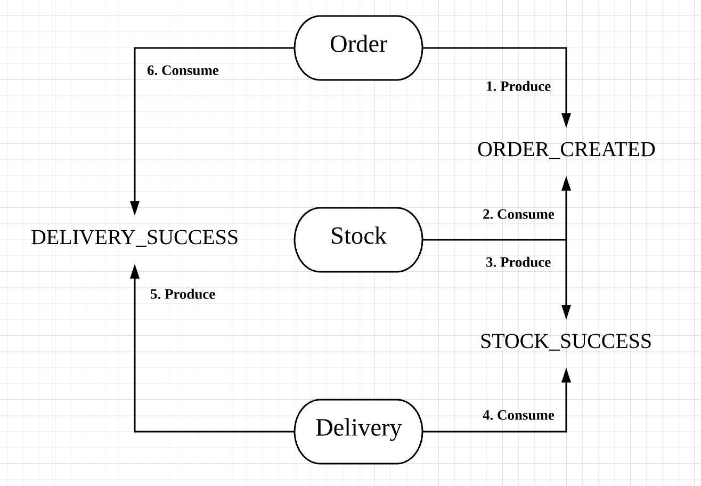

# Python SAGA Pattern Example

Implemented SAGA Pattern through python for distributed transaction.

- FastAPI
- RabbitMQ

There is three microsevices.
- Order
- Stock
- Delivery

**Case of success**

Each service is listening to a specific queue, as shown above.

To briefly explain the flow,

1. **User** - Order product through `/order/{item_id}`
2. **Order** - Execute local transaction
3. **Order** - Produce event to `ORDER_CREATED`
4. **Stock** - Consume `ORDER_CREATED` and if got some, execute local transaction
5. **Stock** - Produce event to `STOCK_SUCCESS`
6. **DELIVERY** - Consume `STOCK_SUCCESS` and if got some, execute local transaction
7. **DELIVERY** - Produce event to `DELIVERY_SUCCESS`
8. **Order** - Consume `DELIVERY_SUCCESS`
9. **Order** - Change order status to `complete` and distributed transaction is end